# The Watcher

A local-first **flight-data-recorder for offensive-security practice**. It records the commands you
run against a target on **any training platform** — Hack The Box, TryHackMe, OffSec, Immersive Labs,
or a local/CTF box — and turns them into a graded debrief — a Lighthouse-style audit per phase: what
you achieved, where you wasted time, and what to do better next time.

Your run is read through three frameworks at once: **MITRE ATT&CK** for *what* you did, the **Unified
Kill Chain** for the *order* it should happen in (so backtracking and clean progression are
measurable), and **CWE** for the *weakness class* you exploited (so SQLi and XXE count as two skills,
not one technique).

Everything runs on your machine. No account, no telemetry, no cloud.

> **Testing this?** Start with **[TESTING.md](TESTING.md)**.

## See it live

While you're on the box, the **Live Ops** panel is a companion you glance at — where you are in the
kill chain, whether you're getting loud, and what your last moves mapped to — and, while you're
recording, a **next-move nudge** pointing at the single highest-value methodology check you haven't hit
yet, alongside a running findings count. It streams as you work:

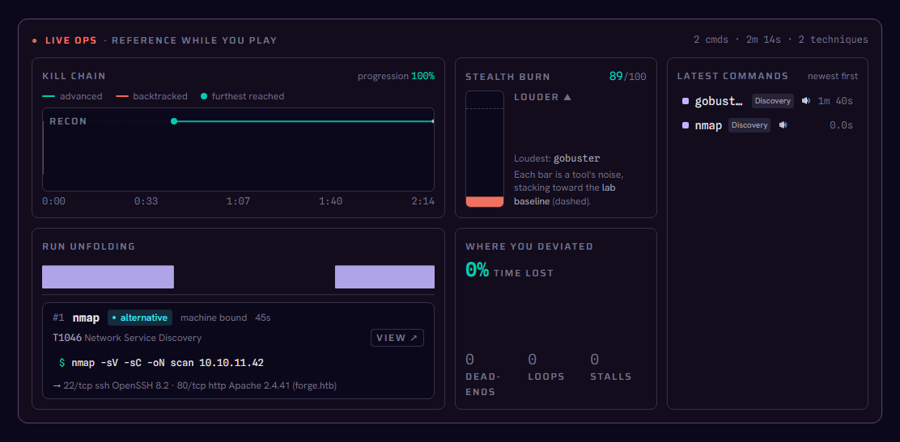

*A demo run against **Forge** (a real HTB machine), time-compressed. Kill-chain trajectory climbs as
you advance (and dips red on a backtrack), the stealth column fills toward the lab baseline, and each
command lands in the feed and the run ribbon.*

## Try it

- **Watch the whole thing:** run the app (below) and open **History → ▶ Watch live demo** — it streams
  the Forge run end to end, then settles into the graded report.
- **Just see the report (no install):** open `report.html`, or generate it with
  `npm install && npm run export` → `dist/report.html`.
- **Run the app:**

  ```sh
  npm install
  npm run tauri dev     # desktop app
  # or
  npm run dev           # report UI in a browser → http://localhost:5173  (append ?demo=live to auto-play)
  ```

## Progress — across runs

Once you've logged a couple of runs, the **Progress** tab (alongside History) plots grade, coverage,
and methodology across your run history on one chart, with a click-through card per run. Sessions
recorded before the methodology engine existed just show a gap in that line instead of a guess.

## The debrief, section by section

When the run ends, the live panel settles into a graded report. Every view below is from that same
Forge playthrough — nothing is a mock-up. A fuller visual redesign of this debrief is a deliberate
next pass, not this one.

### Headline — box, stealth, and grade

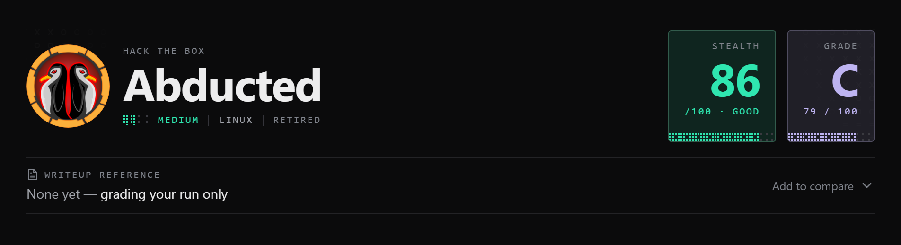

The machine, its difficulty, and the two numbers that matter at a glance: **Stealth** and **Grade**,
each tinted by quality.

### Run summary — the run at a glance

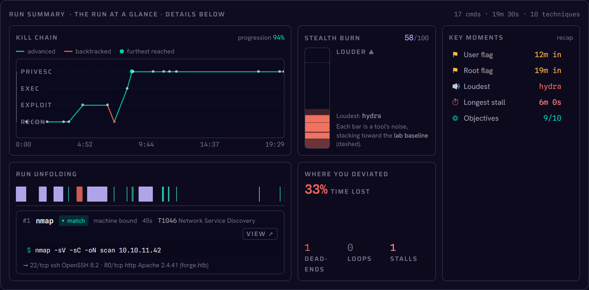

The same bento the live panel used, now settled: the **kill-chain trajectory** (advances green,
backtracks red), the **stealth burn** stacking toward the lab baseline, **key moments** (flags with
timing, loudest tool, objectives), the **run timeline**, and **where you lost time**. Every tile links
into the matching detail below.

### Phase audit — one card per MITRE phase

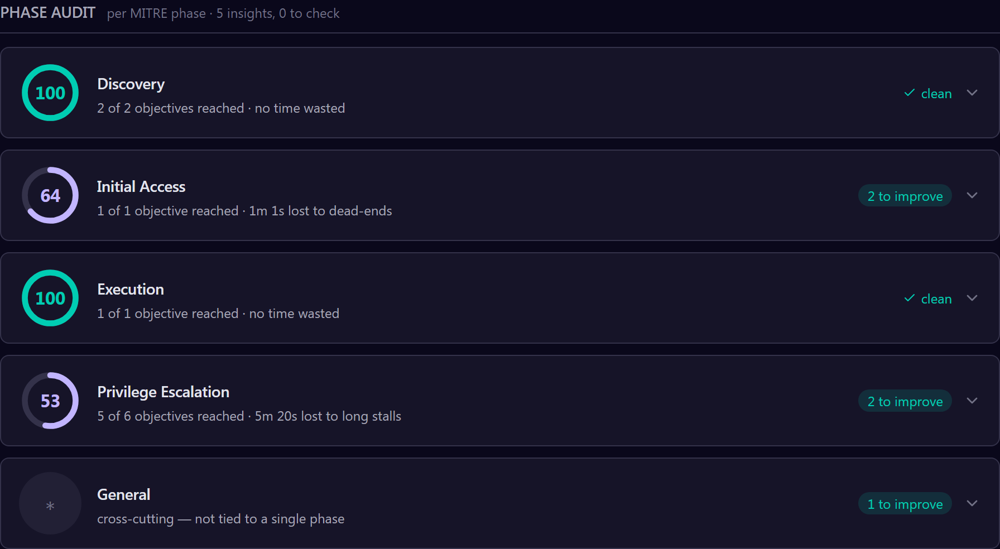

Lighthouse-style. Each phase (Discovery → Initial Access → … → Privilege Escalation) gets an efficiency
ring, the objectives reached, its ATT&CK techniques, and the highest-impact next moves — each with an
estimated time saved.

### What you'd do differently — vs the write-up

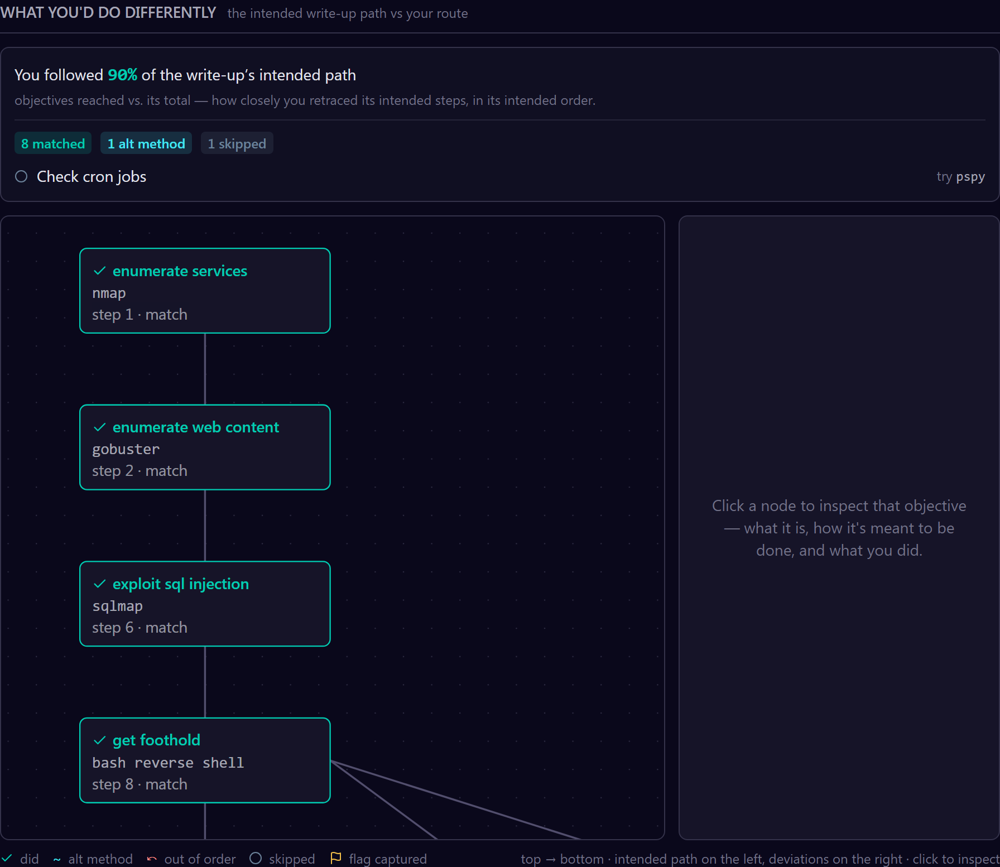

Your route diffed against the write-up's intended path: matched steps, alternative methods, out-of-order
moves, and skips. Here: **90% coverage** — the only miss was the cron-job check (`pspy`).

### The Ghost — you vs. the optimal-from-your-state line

Where a run has an intended path, **The Ghost** derives what the optimal line would have looked like
from *your* findings at each moment — not a live agent replaying the box, a deterministic diff between
your actual sequence and that derived line. Most verdicts call out lost time (a **late pivot**, a
**skip**), but it leads with the two that matter more: **ahead**, where you moved before the finding
that "should" have unlocked the step had even surfaced, and **off-path win**, where you reached an
objective by a route the write-up never mentions. Optional model narration can sharpen the wording per
item — redacted to the objective, verdict, and timings, nothing else — but the deterministic note
underneath always stands on its own. It's post-run coaching only: absent with no intended path, and it
never feeds the letter grade.

### Grade — the explainable scorecard

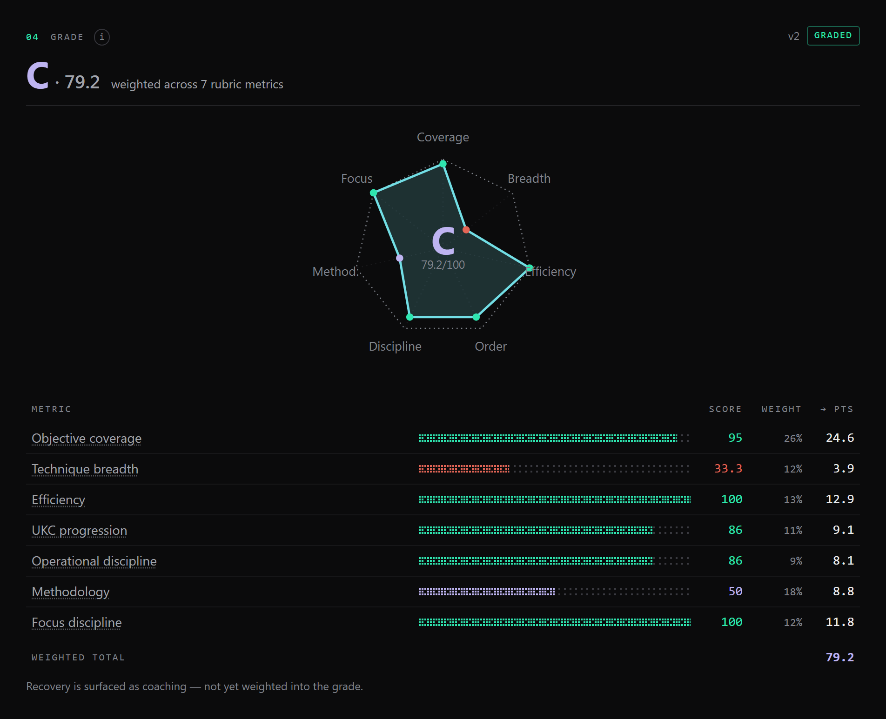

The radar plots the six weighted dimensions with the letter in its center; the table shows the
score × weight → points math behind it. Independence is a gate routed to a human, not an auto-verdict.

**Methodology signals.** Three more deterministic checks run alongside the rubric: **methodology
coverage** (did you run the standard check for each phase you touched — SUID sweep, cron check, and
so on), **focus discipline** (did you get pulled into a low-yield rabbit hole instead of stepping back
to re-enumerate), and **recovery** (how long it took to get back on track after a dead end). They show
up as coaching in the Phase Audit and as `metrics.methodology_coverage_pct`, `focus_discipline_pct`,
and `recovery_median_ms` in the report JSON — informing the write-up, not the letter grade. Folding
them into the weighted score is a future decision, not this one.

### Kill chain & frameworks — ATT&CK · UKC · CWE

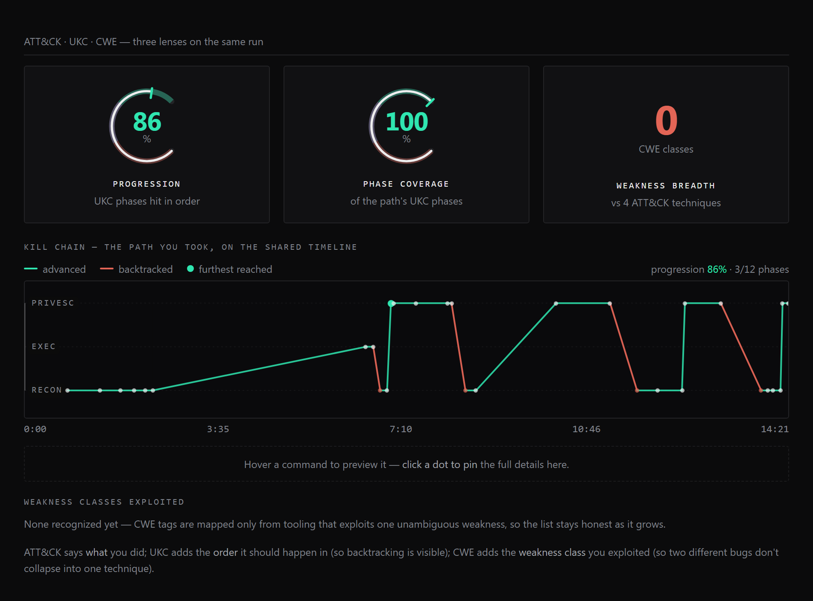

Three lenses on the same run: ATT&CK says *what*, the Unified Kill Chain adds the *order* (so
backtracking is visible), and CWE names the *weakness class* exploited.

### Attack timeline — the phases on one axis

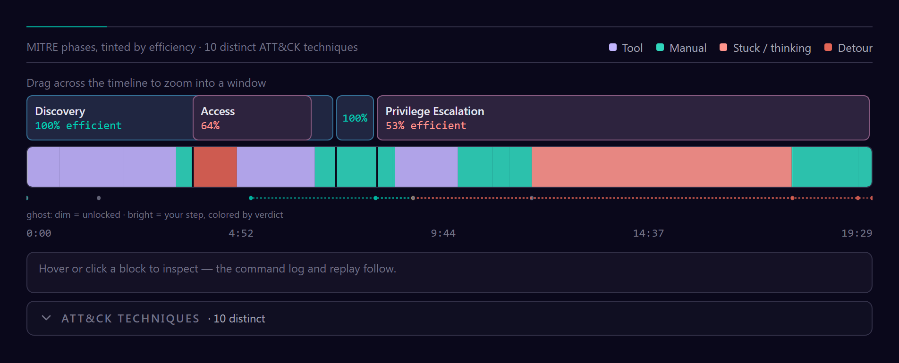

The MITRE phase ribbon tinted by efficiency, over a host / on-target episode ribbon — drag to zoom,
scrub the playhead, hover any command.

### Stealth & noise — the exposure curve

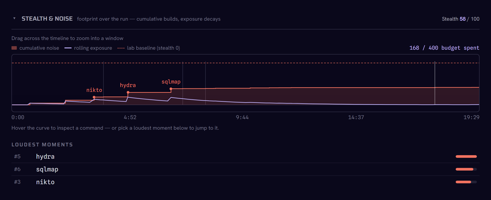

Cumulative noise climbing toward the lab baseline, the rolling-exposure decay, and a ranked list of
your loudest moments.

### Where you lost time — dead-ends, loops, stalls

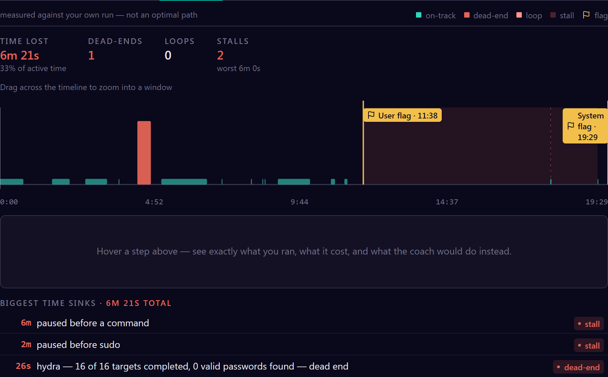

Self-relative waste — the spikes where a dead-end, a loop, or a stall cost you time, with the biggest
sinks called out.

### Command log — a DVR of the run

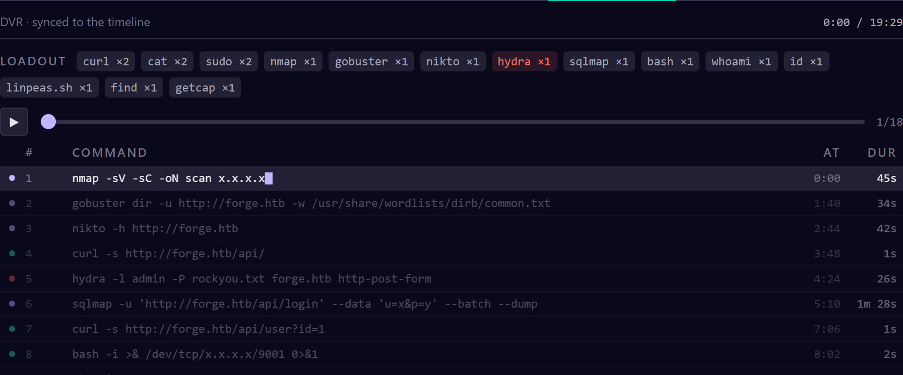

Every command on the shared timeline, a tool-frequency loadout, and a play/scrub head — the raw record
behind all the analysis.

## Capture your own runs

```sh
cd crates/capture && cargo build --release
./target/release/watcher-capture --attach --machine <box>
```

Commands stream into the app live; `exit` to stop. Pass `--platform <htb|thm|offsec|immersive|local>
--target <name>` to name the target neutrally instead of (or alongside) `--machine` — it's how a
capture declares which platform it belongs to without hardcoding HTB. In-app **Install** tab walks
through both capture paths (your own VM over VPN, or in Pwnbox). Full guide:
**[crates/capture/CAPTURE.md](crates/capture/CAPTURE.md)**.

## Adding a platform

The Watcher grades any run the same way; a "platform" is just a **detect + identify** seam over that
neutral pipeline. Adding one is a single adapter file in `src/lib/platform/` — see `htb.ts` or
`thm.ts` for the shape (`id`, `label`, `kindNoun`, `detect()`, `identify()`, and an optional
`intendedPath()` if the platform has a structured task list to parse natively instead of falling back
to write-up extraction). Register it in `ADAPTERS` in `src/lib/platform/index.ts`, then run
`npm run platform:conformance` — every adapter in `ADAPTERS` must pass `checkAdapter()`
(`src/lib/platform/conformance.ts`) before it's wired in.

Today only TryHackMe has a native intended-path — a deterministic parse of the room's pasted task
list, no model involved. HTB, OffSec, and Immersive Labs all have detection and identity, but no
native intended-path yet: they grade against a write-up run through the (local or cloud) model
instead. HTB additionally has automated write-up fetching (0xdf's sitemap, the official write-up via
your HTB API token) — convenience for *getting* a write-up, not a substitute for a native path.

## How it works

A small Rust agent captures your shell through a normal PTY (ConPTY on Windows, openpty on Unix — **no
eBPF, ptrace, or kernel hooks**). The capture is processed **deterministically** (segmentation, MITRE
tagging, golden-path diff, metrics) into one versioned JSON report
(`schema/watcher-report.schema.json`) that the UI renders. An optional model — local Ollama, or an
opt-in cloud model — only sharpens the coaching text; it never changes the numbers.

## Layout

```
src/            report UI (React + Tailwind) + deterministic pipeline & metrics
src-tauri/      desktop shell (Tauri)
crates/         the Rust side:
  capture/        PTY capture agent
  core/           shared session lifecycle + redaction
  daemon/         optional: single-owner store daemon
  store/          optional: encrypted SQLCipher store
plugins/        optional plugin API (SDK + conformance kit)
schema/         the versioned JSON contracts
fixtures/       sample sessions   ·   scripts/ tests/   tooling & tests
```

## Privacy

By default your session never leaves the machine, and redaction runs before anything hits disk. Two
opt-in paths make outbound requests, each by your action: fetching a write-up you asked for (a public
blog, or your own HTB write-up via the API once you add a token), and — only if you pick a **cloud**
coaching model (Claude / ChatGPT / Gemini) over the local one — sending that model your commands,
redacted first (IPs, creds, flags stripped). Rules-based and local (Ollama) coaching stay fully
offline; API keys and tokens are stored only on your machine. More in [TESTING.md](TESTING.md).
