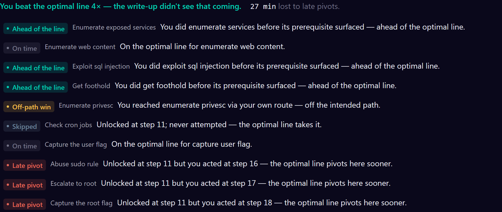

<div align="center">

# The Watcher

**A local-first flight-data-recorder for offensive-security practice.**

Record your run against any box, then get a graded debrief: a Lighthouse-style audit of what you achieved, where you wasted time, and what to fix next.

[Features](#features) · [Install](#install) · [How it works](#how-it-works) · [Testing](TESTING.md)

</div>

<p align="center">
  
</p>

---

The Watcher records the commands you run against a target (and, optionally, the web attacks you drive through Burp), then turns the run into a graded debrief. It works on any training platform: Hack The Box, TryHackMe, OffSec, Immersive Labs, or a local CTF box.

Every run is read through three frameworks at once:

- **MITRE ATT&CK** for *what* you did.
- **Unified Kill Chain** for the *order* it should happen in, so backtracking and clean progression become measurable.
- **CWE** for the *weakness class* you exploited, so SQLi and XXE count as two skills, not one technique.

Everything runs on your machine. No account, no telemetry, no cloud.

## Features

- **Graded debrief, per phase.** A Lighthouse-style audit across ATT&CK, the Unified Kill Chain, and CWE, ending in an explainable letter grade you can hover to see the math behind.
- **The one lesson.** The single highest-value thing to fix next time, chosen deterministically and deep-linked to the exact step.
- **Live Ops as you work.** Where you are in the kill chain, how loud you're getting, and a next-move nudge, all streaming in real time.
- **The Ghost.** The optimal line derived from *your own* findings, showing where you went ahead, off-path, or pivoted too late — and, even with no write-up, the missed opportunities your own run proves: a credential you found but never used, an access you opened but never audited, a faster privilege-escalation path than the one you took.
- **Where you lost time.** Dead-ends, loops, and stalls, measured against your own pace and pinned to the phase they happened in.
- **Compared to the write-up.** How much of the intended path you retraced: matched steps, alternatives, out-of-order moves, and skips.
- **Terminal capture, any platform.** A userspace PTY agent with no eBPF, ptrace, or kernel hooks.
- **Optional web capture.** Drive the target through Burp and `--web` folds graded HTTP attacks (SQLi, IDOR, traversal) onto the same timeline.
- **Progress across runs.** Grade, coverage, and methodology charted over your history.
- **Local-first.** Deterministic scoring. An optional local (Ollama) or opt-in cloud model only sharpens the wording, never the numbers.

## Install

### 1. Download the desktop app

Grab the installer for your OS from the **[latest release](https://github.com/silofy/watcher/releases/latest)**: `.dmg` (macOS, Intel + Apple silicon), `.msi` / `.exe` (Windows), `.AppImage` / `.deb` / `.rpm` (Linux).

The builds aren't code-signed yet, so your OS will warn on first launch:

- **macOS:** right-click the app → **Open** → **Open** (once; after that it launches normally).
- **Windows:** SmartScreen → **More info** → **Run anyway**.

Every file in a release is listed in its `SHA256SUMS` if you want to verify a download by hand.

### 2. Install the capture agent

One line, no Rust toolchain. It downloads the prebuilt binary for your OS and CPU, verifies it against the release's `SHA256SUMS`, and installs `watcher-capture`:

```sh
curl -fsSL https://raw.githubusercontent.com/silofy/watcher/main/install.sh | sh     # Linux · macOS · Pwnbox
```

```powershell
irm https://raw.githubusercontent.com/silofy/watcher/main/install.ps1 | iex         # Windows
```

The Linux binaries are fully static (x86_64 and aarch64), so the same file runs on Pwnbox, Kali, Parrot or any distro. See [Capture your own runs](#capture-your-own-runs) for what to do next.

### Or: just look at a report in your browser

No install at all. Open the [live demos](#demos), or run the report UI locally:

```sh
npm install
npm run dev
```

Open **http://localhost:5173**. The History tab includes two real-content demos (HTB Abducted, THM RootMe); click **▶ Watch live demo** on either to stream the full run live, then review the graded report. Append `?demo=abducted` or `?demo=rootme` to auto-play. You can also open a prebuilt `report.html`, or generate one with `npm run export` → `dist/report.html`.

### Or: build from source

```sh
npm run doctor        # checks Rust + platform libraries, and prints the fix for anything missing
npm run tauri dev
```

**Requirements**

| Component | Linux | macOS | Windows |
| :-- | :-- | :-- | :-- |
| **Node 20+** | ✓ | ✓ | ✓ |
| **Rust** (via `rustup`) | ✓ | ✓ | ✓ |
| **Desktop libraries** | `libwebkit2gtk-4.1-dev` + friends | Xcode Command Line Tools | MS C++ Build Tools + WebView2 (preinstalled on Win11) |

The first desktop build takes a few minutes; after that it's fast. Install Rust in one line on Linux or macOS:

```sh
curl --proto '=https' --tlsv1.2 -sSf https://sh.rustup.rs | sh
```

New here? The full walkthrough (Pwnbox, capture, redaction) lives in **[TESTING.md](TESTING.md)**.

## Demos

Two real runs you can watch build live in your browser, no install:

- **HTB Abducted** (medium). Samba print-job command injection for a foothold, `rclone reveal` for credentials, Samba wide-links to pivot, then a writable systemd drop-in to root. [▶ Preview in your browser](https://silofy.github.io/watcher-demos/?demo=abducted)
- **THM RootMe** (easy). A `/panel` upload-filter bypass to a `www-data` shell, then a SUID-python GTFOBins jump to root. [▶ Preview in your browser](https://silofy.github.io/watcher-demos/?demo=rootme)

Each streams the run command by command, then settles into the graded debrief. Both are transcribed from public write-ups, with flags and credentials redacted.

## The debrief, section by section

When the run ends, the live panel settles into a **single-column, lesson-first report**. The reading order follows the hierarchy: the verdict, then the one thing to fix, then the detail, arranged so "what do I do differently next time" is answered before you scroll.

### Verdict band


The target and its platform (HTB · TryHackMe · OffSec · Immersive · local), the difficulty, whether you rooted it, and the two numbers that matter at a glance: **Stealth** and **Grade**, each tinted by quality.

### The one lesson

Leading the report is one prominent, evidence-backed lesson, not a recap. It's the highest-value thing to change next time, picked deterministically from the run's own signals: the biggest **Ghost late-pivot** ("you unlocked SMB early but acted on it late"), else the top **methodology miss** ("445 was open and you never enumerated it"), else the worst **rabbit hole**, else the first actionable coaching step. It deep-links to the step it's about.

### What you'd do differently


Leads with how closely you retraced the intended path (**N% of the write-up's path followed**), then a route bar: the write-up's objectives in order, one cell each, so matched steps, alternative methods, out-of-order moves and skips show at a glance. Below it, **Change next time** lists only the deviations, each with its fix (for a skip, the tool the write-up used). The full path map is one click away.

### Phase audit


Lighthouse-style, one card per MITRE phase. Each phase (Discovery → Initial Access → … → Privilege Escalation) shows its efficiency score, the objectives reached and the time lost; expand it for its ATT&CK techniques and the highest-impact next moves, each with an estimated time saved.

### The Ghost



Where a run has an intended path, **The Ghost** derives what the optimal line would have looked like from *your* findings at each moment. It isn't a live agent replaying the box; it's a deterministic diff between your actual sequence and that derived line. Most verdicts call out lost time (a **late pivot**, a **skip**), but it leads with the two that matter more: **ahead**, where you moved before the finding that "should" have unlocked the step had even surfaced, and **off-path win**, where you reached an objective by a route the write-up never mentions. The result is one chart: a row per objective, marking where it became reachable and where you acted, so a run of late pivots reads as a staircase. Hover or focus a row for the detail, and click to replay that step. Optional model narration can sharpen the wording per item (redacted to the objective, verdict, and timings, nothing else), but the deterministic note underneath always stands on its own.

**No write-up? The Ghost still runs.** With no intended path to diff against, it falls back to the missed opportunities your own run *proves* — never a guess. Three signals, each emitted only when the captured facts back it: a **credential you found but never used** (surfaced, then no authentication attempt followed), an **access you opened but never audited** (an anonymous share listing succeeded, but you never checked the share permissions), and a **slower-than-necessary privilege escalation** (a confirmed root path was on the table before the one you took). They read as the same `skip`/`late pivot` verdicts, and where a write-up *is* present they layer on top of it, de-duplicated so a lesson never shows twice. Like the rest of the Ghost, it's post-run coaching only and never feeds the letter grade.

### Grade


The radar plots the active rubric's weighted dimensions (six for older **v1** reports, eight for reports that carry methodology and focus signals, **v2**), with the letter in its center. The table shows the score × weight → points math behind it, and **hovering any metric name explains what it measures and its scale** (for example, "technique breadth: distinct ATT&CK techniques, target of 12"). Independence is a gate routed to a human, not an auto-verdict.

**Methodology signals.** Three deterministic checks run alongside the rubric. **Methodology coverage** asks whether you ran the standard check for each phase you touched (SUID sweep, cron check, and so on). **Focus discipline** asks whether you got pulled into a low-yield rabbit hole instead of stepping back to re-enumerate. **Recovery** measures how long it took to get back on track after a dead end. Methodology and focus now feed the letter grade directly (rubric **v2**) for reports whose JSON carries those signals; older reports keep their original **v1** grade, and nothing is retroactively rescored. Recovery stays coaching-only: it surfaces in the Phase Audit, informing the write-up rather than the score. All three are exposed in the report JSON as `metrics.methodology_coverage_pct`, `focus_discipline_pct`, and `recovery_median_ms`.

### Evidence & detail

The full detail views live behind a single **Evidence & detail** drawer, collapsed by default so the report leads with the lesson, not the raw log. Inside they're **tabs** rather than a long accordion, and a "step N" link anywhere in the report opens the drawer and jumps to that command.

<details>
<summary><b>The six detail tabs</b></summary>

<br>

**Kill chain & frameworks** (ATT&CK · UKC · CWE)


Three lenses on the same run: ATT&CK says *what*, the Unified Kill Chain adds the *order* (so backtracking is visible), and CWE names the *weakness class* exploited. Every technique id is hoverable: name, plain-English description, and a link to the MITRE page.

**Attack timeline**


The MITRE phase ribbon tinted by efficiency, over a host / on-target episode ribbon. Drag to zoom, scrub the playhead, hover any command.

**Stealth & noise**


Cumulative noise climbing toward the lab baseline, the rolling-exposure decay, and a ranked list of your loudest moments.

**Where you lost time**


Self-relative waste: the spikes where a dead-end, a loop, or a stall cost you time, with the biggest sinks called out.

**Findings** (the evidence ledger)

Structured findings pulled from your output (open ports, services and versions, URLs, credentials, hashes, flags), each linked to the command that surfaced it and the later steps that used it. A captured flag is marked **proven** only when it was actually observed, so "reached" and "proven" don't blur.

**Command log** (a DVR of the run)


Every command on the shared timeline, a tool-frequency loadout, and a play/scrub head: the raw record behind all the analysis.

</details>

## Progress across runs

Once you've logged a couple of runs, the **Progress** tab (next to History) plots grade, coverage, and methodology across your history on one chart, with a click-through card per run. Sessions recorded before the methodology engine existed show a gap in that line rather than a guess.

## Capture your own runs

With the capture agent [installed](#2-install-the-capture-agent):

```sh
watcher-capture --attach --platform htb --target <box>
```

It streams each command into the running app live; type `exit` to stop. `--platform` is one of `htb`, `thm`, `offsec`, `immersive` or `local`. Playing in **Pwnbox** (no local terminal to watch)? Install the agent inside Pwnbox with the same one-liner and capture to a file the app pulls in over SSH:

```sh
watcher-capture --export ~/.watcher-exports/run.json --platform htb --target <box>
```

<details><summary>From a source checkout instead</summary>

```sh
npm run capture -- --platform htb --target <box>   # builds the agent the first time, then runs it
```

</details>

The app's setup wizard walks through both capture paths (your own VM over VPN, or in Pwnbox). Full guide: **[crates/capture/CAPTURE.md](crates/capture/CAPTURE.md)**.

## Record your web traffic (optional)

Half of many boxes happens in a browser: a login form, a tampered parameter, a file upload. With **Burp Suite** running and its **MCP Server** extension enabled, add `--web` to any capture and The Watcher folds those HTTP exchanges into the *same* run as your terminal commands, graded on the same timeline. A UNION-tampered parameter counts as SQLi (**CWE-89**), an IDOR as **CWE-639**, a `../` traversal as **CWE-22**. A small `plugins/burp-bridge/` process reads Burp's proxy history over MCP and streams the exchanges in; they land on the attack timeline and Live Ops right alongside `sqlmap`.

It's **off by default** and does nothing until you pass `--web`. When on, it only ingests traffic for Burp's in-scope target, and auth headers, cookies, and bearer/JWT/API-key tokens are stripped before anything is stored or rendered. If Burp or its MCP server isn't reachable, the flag prints a one-line hint and your terminal capture runs exactly as before; the web path never blocks a run. Full setup: **[docs/web-capture.md](docs/web-capture.md)**.

## How it works

A small Rust agent captures your shell through a normal PTY (ConPTY on Windows, openpty on Unix), with **no eBPF, ptrace, or kernel hooks**. The capture is processed **deterministically** (segmentation, MITRE tagging, golden-path diff, metrics) into one versioned JSON report (`schema/watcher-report.schema.json`) that the UI renders. An optional model, either local Ollama or an opt-in cloud model, only sharpens the coaching text; it never changes the numbers.

A run persisted to the optional encrypted store can be rebuilt into the same graded report straight from the store (see **[docs/store-report.md](docs/store-report.md)**).

## Privacy

By default your session never leaves the machine, and redaction runs before anything hits disk. Two opt-in paths make outbound requests, each by your action. One is fetching a write-up you asked for (a public blog, or your own HTB write-up via the API once you add a token). The other, only if you pick a **cloud** coaching model (Claude / ChatGPT / Gemini) over the local one, is sending that model your commands, redacted first (IPs, creds, flags stripped). Rules-based and local (Ollama) coaching stay fully offline, and API keys and tokens are stored only on your machine. More in **[TESTING.md](TESTING.md)**.

## License

[AGPL-3.0](LICENSE). You can use, study, and modify The Watcher freely; if you distribute a modified version, or run one as a network service, you must publish your changes under the same license.
